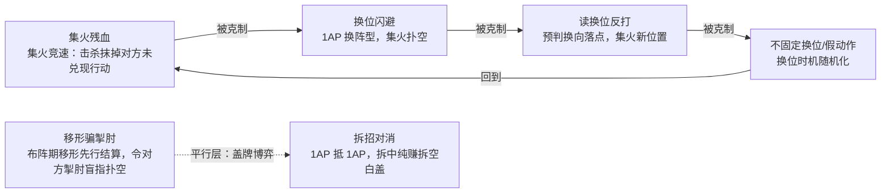

# 《问剑》战斗策划案 · 论剑模式（技能 / 节奏 / 博弈链）

> 版本：v1.0（对齐数值策划案 v2.4 定稿 + v3.1 实装 + 升星绝技强化定稿）
> 岗位视角：战斗策划。本文不重复数值案的公式推导，聚焦**玩家在每个时点面对什么选择、系统如何把这些选择变得可读、可猜、可翻盘**，以及战斗表现层如何服务理解。
> 规则真相来源：`contracts/game.ts`（前后端共用引擎，服务器权威执行）；平衡性结论来源：`sim/REPORT.md`（蒙特卡洛模拟，每组 ≥5000 局，95% 置信区间）。文中所有数字均与这两处一致，与数值案历史数字有出入处以引擎/最新报告为准并注明。

---

## 一、设计目标：战斗体验要交付什么

数值策划案的设计铁律是"**阵容确定后不能定胜负——局内运营必须有翻盘空间**"。落到战斗策划侧，这条铁律拆成四个可检验的体验目标：

1. **每 30 秒有一次真决策**。三小轮结构 + 暗置指令，要求每个决策点都是"我知道一些、不知道一些"的不完全信息博弈，而不是算最优解。
2. **猜拳链必须咬合成环，还得让玩家看见**。集火怕换位、换位怕被读、读换位怕被反读——玩家要能在战报和飘字里**看见自己为什么赢/输**，否则博弈链只是黑盒。
3. **运气要被框在公平结构里**。三率判定是唯一运气源，双方同规则同概率；UI 必须把判定类型即时、分等级地呈现出来，让"神妙翻盘点"成为可记忆的高光时刻而非不可知的随机数。
4. **每个时点都有"我在想什么"**。布阵时想阵容与盖牌、翻牌后修正读盘、每小轮分配 AP 与读对面意图、赛点局做田忌赛马式的资源取舍。本文第九章逐一展开。

体验支柱与数值支柱的映射：田忌赛马（Bo5 + AP 利息）→ 跨大局节奏设计；盖牌即站位 → 信息递进设计；公平运气 → 判定反馈设计；面板公平 → 技能定位设计。

---

## 二、战斗结构：大局套三小轮

### 2.1 时间轴

一场论剑是 Bo5（先胜 3 大局，9 大局封顶，九局战平掷签定胜）。单大局时间轴：

```
布阵（暗置盖牌，双方独立提交）→ 锁阵 + 翻牌公开（策略卡/判定卡/法器/升星全部亮明）
  → 小轮1：暗置指令 → 换位先行 → 按速度同时结算 → 战报回放
  → 小轮2：同上（带着翻牌与小轮1的信息）
  → 小轮3：同上（信息最全，也是终结轮）
  → 封盘：层级结算（①剩余存活数 ②存活持平比总伤害量 ③双空城平轮不计分）
  → 下一大局：气血/内力清零重抽 4 张；比分、AP 结存（×1.5 利息）、法器培养延续
```

### 2.2 战斗节奏表（单大局）

| 阶段 | 玩家动作 | 耗时目标 | 信息量 | 决策性质 |
|---|---|---|---|---|
| 布阵 | 摸 4 选 3 排 1/2/3 号位；盖策略卡(1AP)/判定卡(0AP)；指定法器(1AP/件)；可选升星合成 | 20~40s | 己方 4 张手牌 + 公共池计数（18 张，每侠×3，双方共抽 8 张不放回） | **盲赌**：对面阵容、盖牌全未知 |
| 翻牌公开 | 观看逐张翻开动画 + 拆招对消播报 | 3~6s（自动） | 信息全量公开一次：对面阵容、两张盖牌、法器、升星 | **重估**：所有后续决策的地基 |
| 小轮1 | 每人：待命/普攻(1AP·指敌槽)/绝技(3AP·需蓝满)；另可暗置一次换位(1AP) | 15~30s | 对面阵容已知、意图未知 | **试探**：读出对面集火目标 |
| 小轮2 | 同上，带着小轮1战报 | 10~25s | 对面 AP 余额、内力状态、出手习惯部分暴露 | **针对**：读换位/反读开始 |
| 小轮3 | 同上 | 10~25s | 信息最全 | **终结**：斩杀窗口、保存活、刷伤害量 |
| 封盘 | 看封盘横幅 + 结算明细 | 3~5s（自动） | 存活/伤害明细全公开 | **复盘**：为下大局攒/花 AP 定调 |

节奏设计意图：单大局 1.5~3 分钟，整场 Bo5 约 8~15 分钟——同屏两人传着手机打不嫌长，联网 1.5s 轮询也不至于干等。**布阵是最重的一步棋，小轮里的落子必须比它轻**，否则整场 Bo5 长度失控。

### 2.3 为什么是三小轮而不是两或四

- 两小轮：第一轮的试探信息没有使用场景（刚读完对面就结束了），"信息递进"不成立；
- 四小轮：9 次行动机会 → 12 次，8 AP 的经济张力被稀释，"必然有人歇着"的取舍消失；
- 三小轮恰好让**小轮1 试探 → 小轮2 针对 → 小轮3 终结**构成完整的信息递进曲线，同时 3 人 × 3 小轮 = 9 行动槽 > 8 AP 发放，制造强制取舍（见下节）。

---

## 三、双资源节奏：AP 是外圈，内力是内圈

### 3.1 AP：大局级的行动预算

| 项目 | AP | 战斗侧解读 |
|---|---|---|
| 每大局发放 | 8 | 3 人 × 3 小轮 = 9 槽 > 8 点，**至少一人必须待命一次**——取舍即博弈 |
| 结存 | 未用 ×1.5 带入下大局（节流 ×2），上限 20 | 空城/半空城合法；上限防无限龟缩 |
| 普攻 | 1 | 基准行动单位，一次普攻期望 ≈154~176 伤害（**解析估算值**：输出手 150~225 攻面板按引擎判定树重算，期望倍率 ≈1.12~1.14，对 30~50 抗目标；打 90 抗坦克降至 ≈110~114），**一切 AP 花费都在和"一拳"比价** |
| 绝技 | 3（需内力满） | 三倍价格，必须给出三倍以上的情境价值（斩杀、锁人、群疗），否则就是亏 |
| 换位 | 1（每小轮限 1 次，不占行动次数） | 阵型调整税：防一手，但不产生伤害 |
| 策略卡 | 1（每大局限 1） | 布阵期一次性支付 |
| 判定卡 | 0 | 构筑承诺而非行动（v2.4 定案：付 AP 的判定卡全是陷阱） |
| 法器 | 1/件（布阵期指定，跨大局） | 节奏税换长线复利 |

**AP 节奏的战斗体验关键**：因为 AP 与行动次数几乎 1:1 绑定，集火竞速结构下行动数差近乎线性转化为胜率（**历史模拟估计**：差 1 次行动 ≈ ±20~45pp 胜率；v4 查因表明行动价值依赖基线打法——紧打/松打基线下同一改动的结论方向都可能反转，见 §10.3，故该区间仅为量级参考，不作为通用实测结论）。所以"这 1 AP 花得值不值"不是一个数值问题，而是**"我少打一拳，换到的东西能不能超过一拳"**的节奏问题。所有战斗决策的底层标尺都是这一拳。

### 3.2 内力：小轮级的绝技闸门

- 上场 0 蓝，普攻 +3 即满（**一动即满**），绝技消耗 3 AP 并清空；
- 设计意图：绝技不是"攒出来的大招"，而是"**先干活再放大**"——每个侠客最快小轮1 普攻、小轮2 就能开绝技。这让小轮1 的普攻指令天然携带一层信息："这个侠客下轮可能开大了，对面要不要防？"；
- 凝神佩（上场满内力）打破这条曲线，允许首轮即绝技——它是唯一能用 1 AP 买"先手绝技"的构筑点，也是集火竞速里的爆发先手组件；
- 跨大局内力清零：绝技节奏无法跨局囤积，每大局重新走一遍"普攻→满蓝→抉择"。

### 3.3 速度与小轮内结算

小轮内双方指令同时结算，行动顺序按速度降序（燕惊鸿 115 > 萧战歌 105 > 祝红莲/沈青囊 100 > 铁山河/玄镜 90），同速先洗牌再稳定排序。**先手击杀会抹掉对方未兑现的行动**——这是集火竞速的核心张力来源：击杀不仅是减员，还是"白赚对面已支付的 AP"。这解释了模拟报告查因 D 的斩杀阈值效应：把击杀提前一整个小轮，收益是非线性滚雪球。

---

## 四、行动决策层级：四种指令的博弈分工

每个小轮，每个存活侠客三选一（待命/普攻/绝技），全队另可附加一次换位。决策层级从低到高：

| 指令 | 成本 | 收益模型 | 风险 | 在博弈链中的位置 |
|---|---|---|---|---|
| 待命 | 0 | 攒 AP（×1.5 利息）；隐藏意图 | 站着挨打，节奏落后 | 跨大局运营的基石（空城流 34.7% 胜率，成立但不统治） |
| 普攻（指敌槽位） | 1 | 基准伤害 + 攒蓝 | 打的是**位置**：对面换位则扑空（目标阵亡自动重指最弱者，换位扑空则整拳打错人） | 集火执行单元 |
| 绝技（需蓝满） | 3 | 定位性收益（见技能矩阵） | 输出型绝技被掣肘/金疮药折价；功能型绝技可能是 AP 陷阱（见第十章） | 节奏拐点/斩杀闸门 |
| 换位（己方两槽互换） | 1 | 令对面指向性集火扑空 | 不产生伤害，少 1 拳；被"读换位"反打则白送 | 反制层 |

盖牌（布阵期）是第零层决策：它在小轮循环开始**之前**就锁定了本大局的一张策略卡（1AP）和一张判定卡（0AP），是"用预算买信息优势/数值优势"的开盘注。

**关键规则语义（战斗体验的地基，v3 定案）**：
- 攻击类目标 = **敌方槽位**（打位置，换位可扑空）；
- 增益类目标 = **己方侠客本人**（鼓舞/回春跟随本人，换位不影响落点）；
- 嘲讽 = 锁人（`forcedBy` 跟随嘲讽者本人 id，换位不解套）——坦克对换位的免疫是其特色。

---

## 五、技能矩阵：六侠绝技定位与升星强化

六侠统一基础面板（气血 1000 / 双抗与速度按定位微调 / 命中 95% / 致命 15~25% / 神妙 5~15%），差异只做在**定位、绝技与短板**上。下表数值以引擎 `ROSTER` 与 `STAR_RULES` 为准（与数值案草案有微调，如甲双抗 35 而非 50−15 的表述差异，以代码为准）：

| 侠客 | 定位 | 面板要点 | 绝技（3AP+蓝满） | 升星强化（合成胜率 2 万局实测） | 短板 |
|---|---|---|---|---|---|
| 燕惊鸿（甲） | 物理输出 | 物攻 150~225，速 115，致命 25%，双抗 35 | **连珠**：两段 ×0.8 物攻，两次独立判定 | Lv2 三段 ×0.85 → Lv3 四段 ×0.85；面板 +5%/+10%。合成胜率 **47.4%** ✅ | 双抗最低，被集火优先目标 |
| 祝红莲（乙） | 法术输出 | 魔攻 150~225，血 850，神妙 15% | **炎爆**：2.5× 魔攻单体爆发 | Lv2 2.5×+溅射其余敌人 1.25× → Lv3 3.0×+溅射 1.5×。合成胜率 **49.4%** ✅ | 血量 850 全场最脆，物抗 30 |
| 铁山河（丙） | 物理坦克 | 血 1300，物抗 90，攻 −10%（135~203），速 90 | **嘲讽**：锁敌方攻击最高 1 人，其下次普攻强制改打嘲讽者（`forcedBy` 跟随嘲讽者本人，仅约束普攻） | Lv2 锁 2 人 → Lv3 锁全体。合成胜率 **49.9%** ✅ | 魔抗 35，被祝红莲克制 |
| 玄镜（丁） | 魔法坦克 | 血 1300，魔抗 90，速 90 | **反伤甲**：本大局反弹受击 20% | Lv2 反弹 20%+自疗 15% 上限 → Lv3 反弹 30%+自疗 25% 上限。合成胜率 **50.1%** ✅ | 物抗 35，被燕惊鸿克制 |
| 沈青囊（戊） | 奶妈 | 魔攻 100~180（输出≈0） | **回春**：己方气血最低者回复 30% 上限 | Lv2 全体 20% → Lv3 全体 30%。合成胜率 **52.3%**（平衡带上沿，备选回调 18%） | 无输出，伤害量决胜局吃亏 |
| 萧战歌（己） | 增益辅助 | 魔攻 100~180，速 105 | **鼓舞**：指定队友下次攻击 +50% | Lv2 双目标 → Lv3 全队。合成胜率 **51.9%**（平衡带上沿，备选回调 +40%） | 自身输出低 |

**设计要点**：
- 克制环：甲打丁、乙打丙、丙丁扛甲乙、戊续航、己放大——无万能解，阵容组合即第一层博弈。
- 绝技定价同一道闸（3 AP = 三拳），所以六侠绝技必须各有**不可被普攻替代的情境**：连珠是分散判定下的斩杀（四段独立判定绕过单发高抗性波动）、炎爆是单点爆发、嘲讽是唯一强制改目标手段、反伤甲是集火惩罚、回春/鼓舞是团队轴。
- **升星走绝技质变而非纯面板**是模拟驱动的结论：v3 纯面板扫描证明"合成的真实参照系是把重复卡也摆上场"，2★ 纯数值要到 +15% 才有 35.9%、而 +15% 对无对子方碾压 81.5%——无定价解。绝技强化路线下，六侠合成胜率全部落入 47.4~52.3% 平衡带，对子出现率 60.0~60.4% 的运气只带来 ≤3pp 的条件胜率差。合成从"数值碾压"变成"玩法变体"。

---

## 六、核心博弈链：集火 — 换位闪避 — 读换位反打 — 移形骗掣肘

### 6.1 链条结构（Mermaid）



### 6.2 文字版（四层咬合）

1. **集火**：普攻指向敌方槽位，全队火一人。收益来自斩杀阈值——先手击杀抹掉对面已暗置未兑现的行动，这一拳换的是对面一整轮的 AP。谁先手谁赚，这是默认最优打法，也是模拟器的稳打基线。
2. **换位闪避**：防守方花 1 AP 暗置换位，结算前生效，集火指令打的是旧槽位 → 扑空。理论上 1 AP 废掉对面 2~3 AP 的集火。
3. **读换位反打**：进攻方预判对面"会把残血换走"，直接集火换向后**落点**的槽位。模拟器实测读换位 vs 换位闪避 = 82.7%（历史模拟 78.7%，方向量级一致）——这一层稳如磐石。
4. **不固定换位**：防守方把换位的时机和方向打散，让"读"退化成猜。环就此咬死：集火怕被换、换位怕被读、读怕被不动。

平行层是**盖牌博弈**：掣肘盲指对面一个槽位（攻击 −20%），而移形在掣肘结算**之前**先行换位——布阵期盖的移形可以令对面同样布阵期盲盖的掣肘扑空，这是设计好的跨层博弈：用小轮外的盖牌反制小轮外的盖牌。拆招再盖一层：1 AP 抵消对面整张大策略卡，拆中纯赚、拆空白盖（v4 实测拆招 vs 叫阵 50.5%/49.5%，完美对消均衡；「拆招 vs 无卡仅 17.2%」为**历史模拟数据**，v4 未复跑该场景，仅作方向性风险提示，不与 v4 实测混排比较）。

### 6.3 现状：第二层在当前经济下不成立

这里必须说实话：**"换位闪避克集火"这一层，在当前引擎与紧打基线模拟中方向反转了**。

- 换位闪避镜像 = 50.3%/49.7%、大局均击杀 0.00——机制本身无偏；
- 但稳打集火 vs 换位闪避 = **72.2% 稳打胜**（历史模拟器为 8.7%，方向相反）。
- 原因在经济而非机制：换位 1 AP/小轮 ≈ 一个大局 12.5~25% 的输出税。闪避方能**防**（零阵亡）但不能**杀**（每大局少约 2 次行动 ≈ 少 350 伤害），封盘层级结算"存活持平比伤害"时稳定输。
- 历史 91.3% 要求闪避方少 2 行动仍有约 70% 大局完成击杀，在 8 AP 经济下不成立。

**设计含义**：当前规则下，换位的正确用法是**读对面换位（反打）**与**移形骗掣肘**这两手高阶用法，而非机械闪避。博弈链的三、四层仍成立，第二层是否要成为合法反制，是待拍板的平衡方向（优化假设见第十章）。作为战斗策划，我的立场是：**保留第二层的可能性有价值**——它是新手最直观能理解的反制（"他打我我就躲"），如果它在数值上永远不成立，新手教学会教一个错误直觉。但若降税（如换位 0 AP 限 1 次/大局），必须复测"换位闪避镜像"击杀 0.00 导致的双防互拖问题是否恶化。

---

## 七、三率判定树：运气如何被呈现为"高光"而非"黑盒"

### 7.1 判定树（引擎实现顺序）

```
一次攻击 roll 伤害基数（攻击 × 倍率，区间内均匀）
  → ① 神妙判定（ins，基础 5%~15%）：取区间上限 hi，伤害 = (hi − 抗) × 1.35
  → ② 擦碰判定（1 − 命中，基础 5%；稳军免擦碰）：取下限 lo，伤害 = (lo − 抗) × 0.6（孤注再 ×1.5）
  → ③ 致命判定（crit，基础 15%~25%）：伤害 = (roll − 抗) × 致命倍率
  → ④ 否则命中：伤害 = roll − 抗
致命倍率 = 1.5 + max(0, crit + ins − 1) × 0.6（溢出转化：双率之和破 100% 才触发，当前构筑下恒为 1.5，是为未来堆率流派预留的防溢出结构）
```

设计要点：
- **四档结果有明确的体验等级**：神妙（大金砖，取上限再 ×1.35）> 致命（×1.5）> 命中（基准）> 擦碰（×0.6）。期望伤害倍率 ≈1.12~1.14（随致命/神妙面板浮动），单次普攻期望 ≈154~176（**解析估算值**，口径同 §3.1：输出手面板对 30~50 抗目标）。
- 判定卡联动这棵树：乘势（致命/神妙→追击一拳，追击不再触发乘势、不加蓝——防滚雪球）、稳军（砍掉擦碰档）、孤注（擦碰档 ×1.5）、神机妙算（神妙 +5%）。**判定卡 0 AP** 是 v2.4 用悬崖数据换来的定案：神机妙算胜率仅 22.6%（该数字对应**历史 1 AP/+15% 版本**，机会成本远超收益；当前实装为 0 AP/+5%，勿混用），0 AP +5% 落在 53.4~55.2% 平衡带——盖牌是构筑承诺，不是行动，不该和行动比价。

### 7.2 反馈表达：战斗表现如何服务理解

| 表现元素 | 实现（代码位置） | 服务的理解目标 |
|---|---|---|
| 伤害飘字四色四档 | `components.tsx`：`dmg-god`（神妙金光大字）/ `dmg-crit`（致命朱砂）/ `dmg-hit`（命中墨色）/ `dmg-graze`（擦碰灰小字）；神妙/致命附加判定名小字 | 不看日志也能瞬间读出"这一拳的运气档位"；高光时刻（神妙斩杀）有视觉重量 |
| 战报逐条浮现 | `LogPanel`：CSS stagger 每行 0.16s 递进，含行动方、目标、伤害、判定、击倒标记 | 把"同时结算"还原为可读的行动序列，玩家能复盘"为什么我的集火扑空了" |
| 状态印记（印章徽章） | `fighterMarks`：掣/叫/药/反/鼓/神/乘/稳/孤/嘲 十枚印章，悬停出说明 | 盖牌效果落到人头上的**持续可见性**——被掣肘的 −20% 不是隐藏 debuff |
| 翻牌公开动画 | `RevealsPanel`：双面卡逐张翻转（0.22s stagger），策略卡/判定卡/法器/升星一次亮明 | "盲的是盖的时候，不是永久信息差"；翻牌是小局内的信息重置仪式 |
| 封盘横幅 | `DazheResultPanel`：印章盖下动画（`banner-stamp`）+ 结算明细（存活/伤害两行） | 层级结算的"判词"必须像判词：先给结论再给依据 |
| 换位提示 | 战场横幅常驻"攻击指槽位，换位可扑空"；指令面板普攻目标旁标注 | 新手最容易踩的坑（打位置不打人）在操作点就近提示 |
| PVE 复用资产 | `Battle.tsx`：绝技全屏闪白+大字幕、气竭震动+染色、战斗复盘页（实测 vs 期望伤害、三率分布条） | 复盘页是数值透明化的范本，论剑模式可沿用"实测/期望"对照培养玩家概率直觉 |

原则：**所有随机性都必须事后可解释**。三率是唯一的运气源，那么每一次神妙都必须被看见、被记住——这是"公平运气"支柱在表现层的兑现。

---

## 八、联网模式：服务器权威与信息隐藏

- **服务器权威**：全部判定（抽牌、三率 roll、结算、封盘）在服务端执行同一套 `game.ts` 引擎；客户端只提交意图（DraftPick / Order[]），服务端先 `validate` 后执行——杜绝改包作弊，也保证"规则即真相"：模拟器、同屏、联网跑的是同一份代码。
- **信息隐藏（`clientView`）**：
  - 布阵未完成双方盖定前：对面手牌显示为 `?`，只知道对面"已盖牌/未盖牌"；
  - 指令阶段：对面指令数组清空，只知道"已暗置/未暗置"；
  - 临时字段（`_strategy/_judge/_draws/_stars`）永不离开服务端；
  - 翻牌后一次性公开——**盲盖风险成立（被拆招抵消照付 AP），信息差有时效而非永久**。
- **同屏双人（HotSeat）**：本地跑同一引擎，用"传手机 + 幕布"（pass 模式提示"请另一方回避"）物理实现同等信息隐藏；reveal 模式公开亮阵。两种模式的规则表现零差异，这是"引擎即真相"架构的副产物。
- **轮询节奏**：1.5s 轮询 + 提交后主动刷新；暗置游戏的等待感由"对方已提交"状态可见来缓解（你知道对面动了，但不知道动了什么）。

---

## 九、玩家在每个时点应该思考什么

### 9.1 布阵时（最重决策点，20~40s）
1. **阵容**：4 张里弃哪张？有没有对子可合成（约 60% 概率）？合成 = 绝技质变 + 面板小加成，仍是 3 人（2★）或变 2 人（3★，少一个行动位，谨慎）；
2. **排位的习惯陷阱**：稳打流默认按质量降序落位是**公开习惯**——对面掣肘盲指 1 号位就是读你这个习惯（实测读习惯带来 +2.2pp）。要不要反着摆？
3. **盖牌预算**：策略卡 1 AP 盖不盖？盖进攻（叫阵）还是防御（金疮药）还是反制（拆招/移形）？判定卡 0 AP 盖给谁——乘势绑集火位、稳军绑主 C 防擦碰？
4. **长线**：AP 结存多少进本大局？法器指定谁（主 C 青钢符/灵羽簪 → 血玉镯 的复利路线）？节流盖不盖（服务银行流）？

### 9.2 翻牌后（3~6s 信息冲击）
1. 对面阵容的**击杀优先级表**瞬间重排：谁是 850 血脆皮、谁的抗性被我方克制；
2. 对面盖牌暴露意图：盖了叫阵 → 他这局要抢节奏，我的拆招/金疮药有没有对上？对面盖了掣肘且指中我主 C → 输出曲线重估；我盖的移形有没有骗到对面的掣肘？
3. 对面法器/升星亮明 → 跨大局威胁登记（"他燕惊鸿 2★ 了，连珠三段，我丙的嘲讽优先级上调"）。

### 9.3 每小轮（10~30s）
1. **AP 分配**：这局 8 AP 怎么花到 9 个槽？谁歇着？（歇着的人也在传递假信息）
2. **集火目标**：按"击杀所需攻击次数"挑软柿子，并预判对面会不会换位救；
3. **绝技闸门**：谁蓝满了？3 AP 换什么——连珠斩杀（抹掉对面未兑现行动）？嘲讽锁对面主 C？回春救斩杀线？还是忍住不放（功能绝技可能是 AP 陷阱，见第十章）？
4. **读与反读**：对面上一轮换位了吗？他的换位习惯是什么？我这轮换不换、往哪换？
5. **斩杀窗口**：速度线计算——我的 115 速燕惊鸿先动，能不能在对面出手前完成击杀？

### 9.4 赛点局（比分 2:X）
1. **田忌账本**：AP 结存 ×1.5 的利息数学——这局全仓还是留力？模拟器结论：空城流 34.7%（成立不统治）、银行流+节流 49.2%（平衡带中心），让二追三是合法打法而非翻盘保证；
2. **信息全开的终局博弈**：双方比分、AP 池、法器培养全透明，唯一的盲区只剩本局盖牌——盖牌在赛点局的权重被放大；
3. **伤害量意识**：如果这局大概率杀不出人头差，是不是从开局就按"伤害量决胜"打（金疮药贬值、叫阵/乘势升值）？51.8% 的大局历史上走伤害量次标准，赛点局更是如此。

---

## 十、当前模拟发现与战斗侧优化假设

以下数据全部出自 `sim/REPORT.md`（v4 模拟器，规则即真相，每组 ≥5000 局）。这里按战斗体验重新摆一遍，每条都配上假设和验证方法。

### 10.1 已确认健康的部分
- 镜像基线 50.9%±0.7 无偏；换位镜像精确复现（击杀 0.00）；拆招对消 50.5%/49.5% 均衡；读换位反打 82.7% 成立；节流银行流 49.2%±0.7 定稿；升星六侠 47.4~52.3% 全入平衡带。

### 10.2 发现一：换位闪避不成立（机制无偏，经济不支）
- **事实**：稳打 vs 换位闪避 = 72.2%（方向与历史模拟相反）；换位税 ≈ 每大局 12.5~25% 输出。
- **战斗侧假设 H1**：换位 0 AP、每大局限 1 次 → 闪避成为合法但限量的一手。验证：复跑"稳打 vs 换位闪避"（目标 55~70% 稳打胜，即闪避有用但非墙）+"换位闪避镜像"（警惕击杀 0.00 恶化导致的全局平局率）。
- **假设 H2（替代）**：不动换位定价，改为让"集火扑空"更疼——扑空的攻击不返蓝（当前普攻无论命中都 +3 蓝）。验证：单变量复跑，观察换位闪避胜率与蓝节奏联动。

### 10.3 发现二：叫阵/乘势/法器在紧打基线下偏强（方向与历史扫描相反）
- **事实**：叫阵 +50% → 87.0%（历史 44.7%）；乘势 66.5%（历史 57.1%）；法器指定流 72.3%（历史 29.0%）。两组数字各自自洽，分歧来自基线打法（行动密度拉满 + 斩杀阈值放大）。
- **含义**：若实战玩家接近紧打水平，三者偏强；若实战偏松，则接近历史值。**这是必须用真人原型数据裁决的分歧，模拟器之间无法互相证伪。**
- **战斗侧预案**（上线后触发式回调，避免预防性过调）：叫阵胜率 >55% → 回调 +30% 或改 2 AP；乘势 >55% → 追击倍率 1.0→0.8；法器流持续 >55% → 节奏税 1→2 AP 或限制跨大局叠加。验证：线上 telemetry 分段位统计携带方胜率（低段/高段分开看，因为分歧本质是玩家水平分布）。

### 10.4 发现三：功能绝技是 AP 陷阱
- **事实**：每大局放一次嘲讽的全肉变体仅 9.0%±0.8——3 AP = 三拳的代价远超嘲讽收益；全肉最优打法是**不放绝技纯普攻**（67.3%，偏强）。
- **体验问题**：坦克玩家的"高光操作"（嘲讽锁人）在数值上是亏的——**设计与直觉相悖，是比不平衡更伤体验的问题**。
- **战斗侧假设 H3**：坦克攻击惩罚 −10%→−15%（实测回到 54.0%±1.8，−17% 则 51.5%）先修全肉；随后单独扫描"功能绝技价值"：给嘲讽附加"被嘲讽者本小轮对其伤害 −20%"或把功能绝技降为 2 AP。验证：固定全肉阵容，扫描"放绝技 vs 不放"的内部胜率差，目标是不放不再严格占优（差距 <5pp），让绝技成为情境选择而非陷阱。

### 10.5 发现四：击杀节奏偏慢
- **事实**：紧打基线大局均击杀 1.03，低于 1.5~2.5 健康区间（历史 1.69，差异来自绝技使用频率）。
- **战斗侧假设 H4**：斩杀式绝技使用被低估——若实战玩家更积极用连珠/炎爆抢斩杀（抹行动效应），节奏自然回升；观察线上数据再决定是否动数值（如气血 1000→950）。

---

## 十一、验证指标体系（战斗侧）

| 指标 | 健康区间 | 数据来源 | 触发动作 |
|---|---|---|---|
| 大局均击杀 | 1.5~2.5 | 线上 + 模拟 | <1.5 查节奏（H4）；>2.5 查爆发 |
| 镜像对局胜率 | 50±3pp | 模拟回归 | 引擎改动必跑 |
| 换位闪避 vs 稳打 | 30~45%（闪避方） | 模拟（H1 实验） | 当前 27.8%，若调换位税需复测 |
| 读换位 vs 换位闪避 | ≥70%（读方） | 模拟 | 跌破则说明博弈链第三层失效 |
| 叫阵/乘势/法器携带方胜率（分段位） | 45~55% | 线上 telemetry | 触发 §10.3 预案 |
| 功能绝技使用率 & 使用方胜率 | 使用率 >15% 且胜率不显著低于不用 | 线上 | 低于则 H3 成立需改 |
| 双防互拖平局率 | 平轮大局 <5% | 线上 | 换位税若降需盯 |
| 合成 vs 不合成胜率 | 45~55%（当前 47.4~52.3%） | 模拟回归 + 线上 | 戊/己贴带上沿，>55% 触发备选回调 |
| 封盘次标准占比 | 30~55%（当前历史值 51.8%） | 线上 | 过高说明击杀层失效 |

---

## 十二、风险与迭代路线

1. **最大风险**：叫阵/乘势/法器的两个模拟器方向分歧（§10.3）。缓解：上线灰度 + 分段位 telemetry，回调预案先写好不动手。
2. **体验风险**：功能绝技 AP 陷阱会让坦克/辅助玩家觉得"放技能不如平A"——优先于数值平衡修复（H3）。
3. **教学风险**：换位闪避不成立 vs 新手直觉"被打就躲"。缓解：新手引导直接教"读换位"与"移形骗掣肘"两个成立用法；若 H1 通过则第一层直觉也成立，教学负担最轻。
4. **迭代顺序建议**：① 全肉 −15%（模拟已验证）→ ② 功能绝技价值专项 → ③ 上线收集叫阵/乘势/法器数据 → ④ 换位税实验（H1/H2 二选一）→ ⑤ 击杀节奏复核。

---

## 附：来源文件清单

| 文件 | 用途 |
|---|---|
| `/mnt/agents/upload/问剑_数值策划案_v2_论剑模式.md` | 数值框架、设计支柱、v2.4 定稿依据、历史模拟结论（§十一） |
| `/mnt/agents/output/app/contracts/game.ts` | 规则真相：`ROSTER`/`RULES`/`STAR_RULES` 全部数值、判定树实现、换位/目标语义、`clientView` 信息隐藏 |
| `/mnt/agents/output/app/sim/REPORT.md` | 全部平衡性数据：锚点回归、查因 A~E、节流定稿、升星定稿、调参建议 |
| `/mnt/agents/output/app/src/pages/lunjian/Panels.tsx` | 布阵/指令面板交互、AP 预算实时显示、封盘横幅 |
| `/mnt/agents/output/app/src/pages/lunjian/components.tsx` | 飘字四色四档、状态印记、翻牌动画、战报回放、比分棋子 |
| `/mnt/agents/output/app/src/pages/lunjian/HotSeat.tsx` | 同屏双人传手机模式、幕布信息隐藏、翻牌仪式 |
| `/mnt/agents/output/app/src/pages/lunjian/Online.tsx` | 联网房间码直连、1.5s 轮询、服务器权威提交流程 |
| `/mnt/agents/output/app/src/pages/Battle.tsx` | PVE 战斗演出资产（绝技闪白大字幕、震动染色、战斗复盘页）——论剑表现层可复用范式 |
