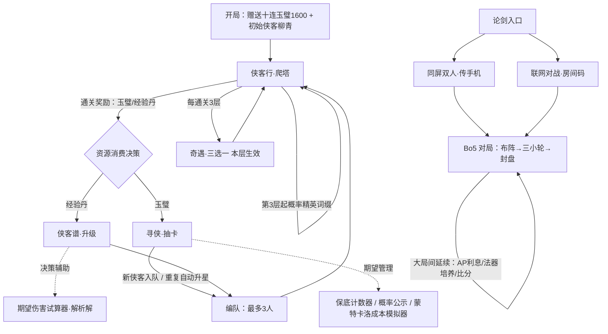
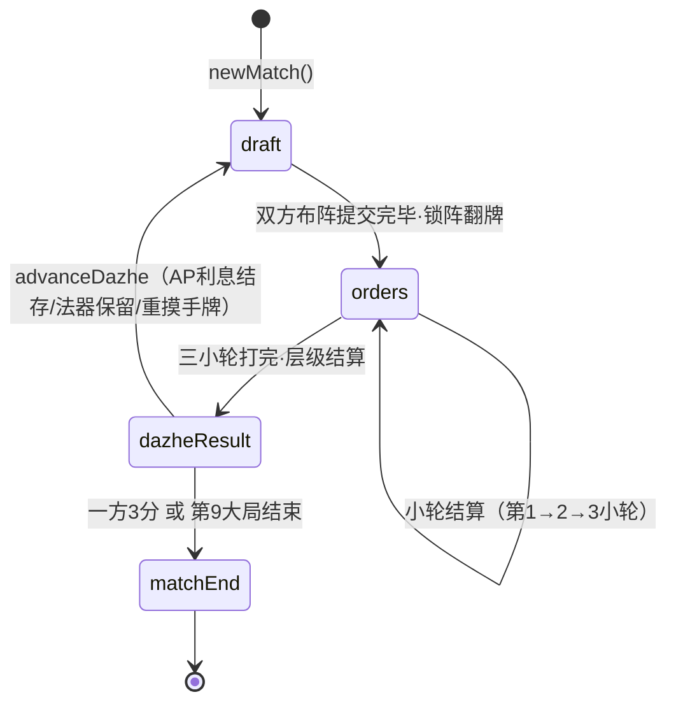

# 《问剑》系统策划案 · 养成 / 经济 / 循环

> 版本：v1.0（demo 现状定稿版）
> 文档定位：系统策划案。数值细节（面板、曲线参数、卡牌效果值）以《问剑_数值策划案_v2_论剑模式.md》与程序配表为准，本文不重复推导数值，只回答四个问题：**系统要解决什么体验问题、玩家怎么流转、资源怎么进出、出了问题怎么兜。**
> 边界声明：本文描述的均为当前 demo 已实现系统的完整规则，以及明确标注的「预留/建议」扩展。当前 demo **不含**付费充值、账号等级、社交关系链、排行榜等后端系统；涉及商业化处一律标注为扩展预留，不作为现状承诺。

---

## 一、系统总览

### 1.1 双支柱结构

《问剑》demo 拆成两条支柱，模块边界清晰，资源池互不依赖：

| 支柱 | 玩法 | 核心体验 | 成长载体 | 运气与操作的权重 |
|---|---|---|---|---|
| **PVE 长线（侠客行）** | 爬塔 + 抽卡 + 养成 | 数值滚雪球、收集与练度管理 | 侠客等级 / 星级（存档级：本地持久，跨对局） | 运气在抽卡，操作在编队与集火 |
| **PVP 局内（论剑）** | 同屏/联网 Bo5 博弈 | 信息博弈、局内经济运营 | 法器跨大局培养 / 升星合成（单局内） | 双方同规则同概率，胜负靠运营 |

两条支柱共用同一套战斗语言（三率判定、伤害公式、侠客绝技），但**资源池完全隔离**：PVE 的玉璧/经验丹不能带入论剑，论剑的 AP/法器不带出对局。隔离是硬约束——PVE 的练度不进入 PVP 的结算输入，「付费/爆肝碾压 PVP」这条武侠 PVP 最常见的信任崩塌路径在结构上不存在。

### 1.2 玩家循环总图

文字说明：

1. **新手起步**：存档初始化即赠送 1600 玉璧（恰好一次十连）与 10 颗经验丹，初始侠客为 3★ 柳青。十连内必得 4★（小保底），保证玩家在第 2 层进入多人战之前，队伍可以从 1 人扩充到 2~3 人——新手段的「获得感前置」是刻意安排的。
2. **PVE 主循环**：打塔 → 领玉璧/经验丹 → 抽卡扩池或喂丹升级 → 编队变强 → 打更深的塔。单轮时长 2~5 分钟（由关卡控制），瓶颈由敌人几何成长曲线制造。
3. **复玩调味**：每通关 3 层触发一次奇遇三选一（本层生效）；第 3 层起普通层按种子概率刷精英词缀怪。二者是同一层内容的「再访问理由」。
4. **PVP 旁路**：论剑不依赖 PVE 进度，任何时候可从入口进入，同屏与联网共用同一套规则引擎。对局内部自成循环：布阵博弈 → 三小轮暗置 → 封盘结算 → AP 利息与法器带入下一大局。

### 1.3 资源一览表

| 资源 | 类型 | 产出 | 消耗 | 上限/约束 | 设计意图 |
|---|---|---|---|---|---|
| 玉璧 | PVE 通用货币 | 通关奖励 `12+3×层数`（首领层 +40，每只精英 +8）；奇遇「摸金校尉」+80；开局 1600 | 抽卡 160/抽 | 无上限 | 抽卡唯一入口货币，产出与层数线性挂钩，卡点时回流刷旧层也有收益 |
| 经验丹 | PVE 养成材料 | 通关奖励 `2+⌊层数/2⌋`；奇遇「山涧清泉」+4；开局 10 | 升级：100 经验/颗 | 无上限；侠客等级上限 60 | 把「练谁」做成稀缺决策而非无脑平铺 |
| 侠客星级 | PVE 稀有投放 | 抽到重复侠客自动 +1 星 | — | 1~5 星；每星全属性 +8%（独立乘区） | 重复卡的保底收益，消除「抽到重复=亏」的挫败 |
| AP（行动点） | 论剑局内经济 | 每大局发放 8 点；未用部分 ×1.5 结存（盖节流则 ×2） | 普攻 1 / 绝技 3 / 换位 1 / 策略卡 1 / 法器 1；判定卡 0 | 单大局可用上限 20 | 3 人×3 小轮=9 行动槽 > 8 发放，取舍即博弈 |
| 内力 | 论剑绝技闸门 | 普攻 +3（一动即满） | 绝技耗空 | 上限 3；大局结束清空 | 绝技「先动一轮才能放」的节奏锁 |
| 法器 | 论剑跨大局培养 | 布阵阶段 1 AP 指定获取 | 占用侠客佩戴位 | 每侠客限 2 件，同件不重复 | 单局内的长线投资，对抗短视打法 |
| 对子/三条手牌 | 论剑构筑分支 | 公共池 18 张（每侠客×3）摸 4 | 合成 2★/3★ 消耗同名手牌 | 3★ 合成需少上 1 人 | 把摸牌运气转化为「可选的风格变体」 |
| 奇遇 buff | PVE 临时增益 | 每通关 3 层三选一 | — | 仅当前层生效，通关即清除 | 风险-收益对价的短线决策 |

---

## 二、PVE 爬塔循环（侠客行）

### 2.1 系统目标

1. 给「养」一个永远看得见的对手：敌人气血按几何级数增长，玩家的线性养成必然在某一层被追上——这一层就是回流点，把玩家导回抽卡与喂丹两个消耗口。
2. 控制卡点节奏：卡得太早流失，卡得太晚没追求。通过 10 层后的成长软着陆，把「第一道硬墙」压在新手期之后。
3. 单层可预览、可复盘：守关敌人在出战前完整展示（名称、气血、韧性、词缀），同层敌人组合由种子随机固定——预览、实战、模拟三方一致，玩家可以研究打法而不是赌刷新。

### 2.2 关卡结构

| 层类型 | 出现规律 | 内容 | 机制要点 |
|---|---|---|---|
| 教学层 | 第 1 层 | 单挑山贼 | 保证首战必胜，教学普攻/绝技/削韧 |
| 普通层 | 非 5 的倍数 | 2~3 名敌人，组合按层数轮换 | 第 3 层起 35% 概率刷 1 只精英（气血×1.2、攻击×1.05、带词缀）；第 10 层起三人波次收敛为双人（数量压力转为质量压力） |
| 首领层 | 每 5 层 | 单体首领战 | 血量 = 层曲线 × 1.8，每深入一个阶层（5 层）血量倍率再 +0.3；气血跌破 50% 进入「困兽」：攻击×1.4、受伤+15%——斩杀窗口博弈 |
| 大关底 | 每 10 层 | 首领 + 1 名护卫（血量为同层山贼 80%） | 逼队伍做转火决策：先清护卫还是硬吃首领 |

### 2.3 成长曲线与卡点设计

敌人缩放规则（配表 `TOWER_CURVE`）：

- 1~10 层：气血每层 ×1.22，攻击每层 ×1.12，防御每层 +2（线性），韧性每层 +15（线性）。
- 第 11 层起软着陆：气血 ×1.10，攻击 ×1.03。

设计理由：气血快几何、攻击慢几何的组合，使「打不动」先于「活不下」出现——玩家首先感受到的是输出缺口（回流抽卡/升级的动机），而不是被秒（纯挫败）。防御只做线性微增，避免防御通胀吃掉低攻击侠客的收益。10 层后衰减是程序自检暴露的结构问题的修复：若不衰减，12 层起所需练度将超出丹药经济的供给上限，循环会断。

玩家侧成长（`engine.grownStats`）：攻击/气血每级 +6%（基于 1 级基础值线性成长，曲线可预期、可心算）；防御每级 +3%；每升 1 星全属性 +8%，星级是独立乘区（与等级乘法叠加，收益不被稀释）。

### 2.4 奖励发放

`floorReward(floor)`：玉璧 `12 + 3×层数`（首领层 +40、每只精英 +8），经验丹 `2 + ⌊层数/2⌋`。

- 精英 +8 玉璧是明确的**风险-收益对价**：精英更硬更快，但打死了多给钱，且精英信息出战前可见，玩家自主选择是否挑战。
- 奖励与层数线性挂钩，保证「回头刷已通关层以下」永远低收益，主推进度而非 farming；同时通关只发一次、失败不发，奖励节奏干净。

### 2.5 失败与撤退

- 战斗失败：无奖励、无惩罚、层数不变，直接「重整旗鼓」回首页。卡点的处理方式是引导（首页提示「数值跟不上就会被数值碾压，先去寻侠或养成」），而非体力惩罚。
- 主动撤退：战斗页提供「撤退（无奖励）」出口，文案明示无奖励，防止误触预期。
- 奖励防重复：胜利结算的 `WIN_FLOOR` 只在点击「领取奖励」时派发一次，前端以 `rewarded` 标记兜底防重复领取。

---

## 三、抽卡系统（寻侠）

### 3.1 系统目标

1. 保底结构用行业通行四件套：基础概率 + 软保底递增 + 硬保底封顶 + 小保底，全部实装。
2. **预期管理前置**：保底计数、当前概率、概率爬坡可视化全部在抽卡页实时展示，不藏不掖。
3. 概率公示可追溯：公示页所有数值直接读自配表 `GACHA`，与线上抽取逻辑同源同文件，杜绝「公示一套、实际一套」。

### 3.2 概率结构

| 名目 | 数值 | 说明 |
|---|---|---|
| 单抽价格 | 160 玉璧 | 十连 1600，与开局赠送等值 |
| 5★ 基础概率 | 1.2% | 池中 2 名：沈孤鸿（剑）、苏挽月（扇） |
| 4★ 基础概率 | 5.1% | 池中 4 名 |
| 3★ | 剩余概率 | 池中 4 名 |
| 软保底 | 第 74 抽起，每抽 +6% | 概率爬坡在 UI 上逐柱可视化 |
| 硬保底 | 第 90 抽必得 5★ | 右尾封死 |
| 小保底 | 每 10 抽内必得 4★ 及以上 | 十连必有正反馈 |

判定顺序：先判 5★（含保底递增），再判 4★（基础概率或小保底兜底），否则 3★；中 5★ 则两个保底计数同时清零，中 4★ 只清 4★ 计数。同稀有度池内等概率。

### 3.3 保底成本模拟器（玩家侧公示工具）

抽卡页内置蒙特卡洛模拟器：实机模拟 5 万名玩家「抽到 1 个 5★ 所需抽数」，输出期望/中位数/P90/P99 与十抽分桶直方图；概率公示页另给出 5★ 综合概率（含保底的长期出率）：按当前 GACHA 参数（基础 1.2%、74 抽起每抽 +6%、90 抽硬保底）解析计算为**约 1.97%，对应期望约 50.7 抽**（解析式：E[N]=ΣP(N≥n)，与 2 万人蒙特卡洛模拟互为印证）。

设计目标：让分布的右尾可控，而不是「让人感觉欧」。把模拟器直接开放给玩家，等于把验证工具当作预期管理工具——玩家开抽前就知道自己最黑要花多少。

### 3.4 重复转化与图鉴

- 抽到已拥有侠客：自动升 1 星（上限 5 星），UI 明示「重复侠客自动转化为升星（全属性 +8%/星，独立乘区）」。不存在「废卡」概念，3★ 也有升星价值。
- 侠客谱即图鉴：已拥有侠客以卡片列表展示称号、流派、星级、等级与完整面板；未拥有侠客当前 demo 不进图鉴（边界项，见 §7）。

---

## 四、侠客养成与期望伤害试算

### 4.1 养成线结构

两条线，一深一浅：

| 线 | 消耗 | 曲线 | 定位 |
|---|---|---|---|
| 等级（1~60） | 经验丹（100 经验/颗） | 升级需求 `50×级 + 25×级^1.7`：前期快（正反馈密集），后期放缓（拉长养成线） | 日常线，丹药经济的主消耗口 |
| 星级（1~5） | 重复抽卡自动转化 | 每星全属性 +8%，独立乘区 | 稀有线，抽卡系统的副产品，不可直接刷 |

升级操作为「服用经验丹」一键到位：逐颗消耗、自动结算溢出经验连升，直到丹药耗尽或满级。边界处理：满级置灰、丹药为 0 置灰。

### 4.2 编队规则

- 出战 1~3 人（首页点选切换，至少保留 1 人，防止空队进入战斗产生异常态）。
- 首页「阵容期望一览」直接展示队内每人的攻击区间与三率面板，编队决策的信息成本为零。

### 4.3 期望伤害试算器（系统侧承诺：信息透明）

侠客详情页内置期望伤害试算：拖动「目标防御」滑杆（0~300），实时重算普攻期望、绝技期望（治疗绝技显示治疗量）、气竭窗口普攻期望，并给出判定树四分支（会意/会心/白字/擦伤）的概率构成条与三率溢出转化明细。

关键点：试算器调用的是**引擎同一个 `expectedDamage` 解析解**，展示与结算同源同输入，不是另一套近似公式。战斗结算页的「复盘面板」同样对照「实测总伤害 vs 理论期望伤害」与三率分布直方，玩家可自行验证运气的公平性。

---

## 五、论剑 PVP（双入口）

### 5.1 系统目标与入口设计

论剑是对「阵容确定后不能定胜负」这条铁律的玩法承载：五局三胜、大局套三小轮、盖牌即阵型、AP 跨大局运营。入口页提供三个并列入口：

| 入口 | 形态 | 解决什么问题 |
|---|---|---|
| 同屏双人 | 一部手机轮流操作，中场幕布遮信息 | 线下当面开局，零网络依赖 |
| 联网对战 | 建房拿房间码发给对手 | 异地对战；服务器权威判定，客户端只提交意图 |
| 论剑规则书 | 侠客名录/卡牌图鉴/法器谱/结算细则 | 上手成本前置消化，「开打前先抄作业」 |

同屏与联网跑**同一套规则引擎**（`contracts/game.ts`，前后端共用的纯函数状态机），保证两种形态规则零偏差。

### 5.2 对局生命周期（状态机）

文字说明：

- **draft（布阵）**：公共池 18 张（六侠客各 3 张），双方各摸 4 张不放回；选 3 张强制上场（合成 3★ 时只上 2 人），可同时盖 1 张策略卡（1 AP）、1 张判定卡（0 AP，盖在人物卡下）、任意次法器指定（1 AP/件）。双方提交后**同时锁阵翻牌**，盖牌内容以战报公开——盲的是「盖的时候不知道对方盖什么」，不是永久信息差。
- **orders（指令）**：每小轮双方暗置行动指令（普攻/绝技/换位/挂机），同时结算；三小轮信息递进——小轮 1 互相试探，小轮 2/3 带信息决策。
- **dazheResult（封盘）**：层级结算——①存活人数多者胜；②存活持平比总伤害量；③再平则平轮不计分。
- **大局推进**：气血/内力/盖牌全部重置，比分、AP 存款、法器培养延续；`advanceDazhe` 幂等，任意一方推进均可。
- **终局**：先取 3 分者胜；第 9 大局上限封顶，战平则掷签（程序随机）。

### 5.3 AP 利息经济（局内经济系统）

论剑的经济系统只有一个货币 AP，承担三个功能：行动闸门、构筑成本、跨大局赌注。三者共用同一个池子，任何一笔支出都在挤压另外两个功能。

- 每大局发放 8 点；3 人 × 3 小轮 = 9 个行动槽 > 8——**必然有人要歇着，取舍即博弈**。
- 未用 AP ×1.5 结存进下一大局（利息制），策略卡「节流」可把本大局利率提到 ×2；单大局可用上限 20（防龟缩）。
- 挂机合法：不给指令的人物站着挨打，不花 AP 就是攒 AP——「让二追三」是被规则正面承认的打法。

验证回路（`sim/REPORT.md`，v4 模拟器，直接复用线上引擎跑蒙特卡洛，每组 ≥5000 局、关键组 2 万局）：利息 ×1.5/上限 20 下挂机攒点流对稳扎稳打流胜率 **34.7%±1.3**——空城流成立为高风险赌徒打法但不统治；节流银行流在 ×2/上限 20 下定稿 **49.2%±0.7**（平衡带中心），且 20 上限天然封顶节流收益（上限抬到 24 时放大到 +16~21pp 过强，已明确不建议）。经济参数的每一次取值都有模拟报告背书。

### 5.4 卡牌系统（策略卡 / 判定卡）

- 策略卡 6 张（拆招/节流/掣肘/金疮药/叫阵/移形），1 AP 盲盖、每大局限 1 张。拆招对消在锁阵时结算，**被抵消照付 AP**（盲盖的风险定价）；移形在掣肘盲指结算之前生效——移形可令掣肘扑空，这是设计好的博弈层。
- 判定卡 4 张（乘势/稳军/孤注/神机妙算），0 AP 盖在人物卡下——盖牌是构筑承诺而非行动，定价上与行动经济解耦（v2.4 定案）。乘势追击不加内力、不再触发乘势，防滚雪球。

平衡现状与观察名单（来自 v4 复跑）：镜像基线 50.9%±0.7 无偏；神机妙算 53.4%±1.4、拆招对消 50.5%±1.4 均在平衡带；**叫阵 87.0%、乘势 66.5%、法器指定流 72.3% 在本基线下偏强**（与历史扫描方向相反，两组模拟器分歧须以实战数据复核），全肉阵容 67.3% 偏强（调参验证：坦克攻击 −10%→−15% 回到 54.0%±1.8）。这些条目全部列入上线观察名单与迭代路线图（§十）。

### 5.5 法器：跨大局培养线

- 布阵阶段 1 AP 指定获取（指定制，v3.1b 由随机改为指定：可控性优先），6 件：青钢符/灵羽簪（攻）、玄甲坠/辟魔铃（抗）、血玉镯（气血）、凝神佩（上场满内力）。
- 适配规则由数值结构保证：攻击法器对本系侠客 +20%、错系减半 +10%（主副系攻击拆分的天然结果）；防御/气血法器全类型全额。
- 法器挂在**侠客**身上而非单大局人物实例，跨大局持续生效，每侠客限 2 件不同法器——它是论剑里唯一的「长线投资」，对抗单大局的短视最优。

### 5.6 升星合成：局内构筑分支

摸 4 张出现同名时可合成：2★（一对合一，绝技升 Lv2 + 面板 +5%，仍上 3 人）；3★（三条合一，绝技 Lv3 + 面板 +10%，少上 1 人）。绝技强化为质变方向：连珠三段/四段、炎爆溅射、嘲讽多人、反伤自疗、回春群疗、鼓舞多目标。

设计过程是本系统最值得讲的决策：v3 模拟证明**纯面板升星无定价解**（2★+15% 仍只 35.9% 胜率，但抬到值得做就对无对子方 81.5% 碾压——与封穴同款的强度悬崖）；改走「绝技质变 + 小面板」后，2 万局/侠客的定稿扫描显示六侠客合成胜率全部落入 **45~55% 平衡带（47.4%~52.3%）**，对子出现率 60.0~60.4% 的条件胜率差 ≤3pp——对子运只带来小幅波动而非碾压。合成成为「可选的风格变体」而非最优解，绝技 3 AP 的定价闸门天然限制其频率。

### 5.7 目标语义（信息博弈的核心规则）

- 攻击类（普攻/连珠/炎爆）目标 = **敌方槽位**：打的是位置，对方暗置换位可令集火扑空。
- 增益类（鼓舞/回春）目标 = **己方侠客本人**：自己的阵型自己掌控，换位不影响落点。
- 嘲讽 = 锁人（跟随侠客 id），换位不解套——坦克特色。

由此形成博弈链：集火 → 被换位克 → 被读换位克 → 不敢固定换 → 猜拳成立。v4 复跑确认「读换位克换位」一层成立（82.7%±1.1）；「换位克集火」一层在本基线下反转（换位闪避流 72.2% 负于稳打），设计含义与调整预案见 REPORT 查因 E，已列入观察名单。

---

## 六、复玩驱动：奇遇事件与精英词缀

### 6.1 奇遇（每通关 3 层触发三选一）

| 奇遇 | 效果 | 代价 | 定位 |
|---|---|---|---|
| 山涧清泉 | 经验丹 +4，本层开局怒气 +30 | 无 | 稳妥项，收益温和 |
| 破旧剑谱 | 本层攻击 +18% | 受伤 +8% | 进攻向对价 |
| 摸金校尉 | 立即玉璧 +80 | 本层受伤 +12%、敌人攻击 +6% | 经济向对价 |

规则边界：抉择在出战前完成；buff 仅当前层生效，通关或层数变化即清除（存档记录 `eventBuff.floor`，不符则失效）；三选一不可逆。设计原则写在 UI 里：**稳妥项收益温和，激进项带真实代价——风险与收益对价，没有白给的选项**。

### 6.2 精英词缀（第 3 层起普通层 35% 概率）

荆棘（受击反弹 10%）/ 狂暴（气血低于 30% 攻击 +40%）/ 坚韧（免疫擦伤）/ 迅捷（速度 +20 先制）。精英气血 ×1.2、攻击仅 ×1.05——**词缀才是主威胁，避免数值墙掩盖机制**；击杀精英 +8 玉璧作为对价。Boss 层不刷精英，避免与阶段机制叠加失控。

词缀的复玩价值在于「同一层不同解」：荆棘克高频低伤、迅捷要求重排集火顺序、坚韧让高精准流失去优势。词缀出现由种子随机（按层数哈希）确定——同层固定、可复盘、可预览，杜绝「刷词缀」的重开作弊。

---

## 七、功能边界表（当前 demo 做什么、不做什么）

| 系统 | 当前边界（已实现） | 明确不做 / 预留 |
|---|---|---|
| 存档 | localStorage 单存档 `wenjian_save_v1`，损坏自动回退初始档 | 无云存档、无账号体系（商业化扩展预留） |
| 抽卡 | 常驻池单卡池，玉璧唯一货币，游戏内产出 | **无付费充值、无付费货币、无限定池轮换**（预留：货币分层与卡池轮换的配表结构已按稀有度分池，扩展成本低） |
| 图鉴 | 仅展示已拥有侠客 | 未拥有侠客的预览/剪影为边界外（避免承诺未投放内容） |
| 论剑 | 同屏双人 + 房间码联网；无天梯、无战绩持久化、无观战 | 天梯/段位为扩展预留，需先完成 §十 P1 平衡复核 |
| 联网判定 | 服务器权威：全部判定在服务端执行，客户端只提交意图 | 当前无断线重连 UI 层打磨（座位 token 已持久化，具备重连基础） |
| 社交 | 无好友/聊天/公会 | 房间码即最小社交单元，暂不扩展 |
| 战斗表现 | 伤害飘字按判定着色、状态印记、绝技演出、复盘面板 | 无录像回放导出 |

---

## 八、异常处理 / 防刷 / 信息隐藏

### 8.1 输入校验（规则引擎层，非法操作一律拒绝并返回可读原因）

布阵校验（`validateDraft`）：阶段校验、重复提交拦截、必选人数（3★ 合成时 2 人）、手牌下标合法性、升星标记与消耗同名卡数量核验、策略卡/判定卡/法器的存在性与目标合法性、法器限 2 件且同件不重复、AP 总额校验。指令校验（`validateOrders`）：每小轮最多换位一次、同侠客每轮只能行动一次、阵亡侠客不可行动、绝技需内力满、目标槽位合法性、AP 实时扣减校验。

### 8.2 结算与幂等

- 双方盖牌齐了一并锁阵生效，单边提交只记录意图——不存在「后手看到对手牌再改」的窗口。
- 大局推进 `advanceDazhe` 幂等，任意一方触发均可，重复触发无副作用。
- 先手击杀抹掉对方未兑现的行动（阵亡侠客的指令不再执行）；攻击目标槽位已阵亡时，攻击自动改打敌方气血最低的存活者（`weakestSlot` 重定向），无悬挂结算。
- 层级结算第三层「平轮不计分」+ 第 9 大局上限 + 战平掷签，保证 Bo5 必然收敛、无死循环。

### 8.3 信息隐藏（联网模式）

`clientView` 对每位玩家下发裁剪视图：对方手牌以占位符遮蔽；对方未翻的布阵只知「已盖牌」；对方未结算的指令只知「已提交」；所有暂存的盖牌字段（策略/判定/法器/升星）在下发前删除。同屏模式则以中场幕布（pass/reveal 三态）物理遮信息。**盲盖博弈的信任基础是：信息差由系统强制，而不是靠玩家自觉。**

### 8.4 防刷与随机性治理

- PVE 精英/词缀按层数种子哈希确定：预览、实战、模拟三方一致，不可通过重进刷新结果。
- PVE 战斗为回合制单机结算，无时间类收益，无刷取空间；奖励仅通关派发一次。
- 论剑随机源（摸牌、三率、同速乱序、掷签）在联网模式下由服务端执行，客户端不可干预。
- PVE 抽卡随机当前为客户端 `Math.random`（demo 边界）；商业化扩展时必须迁移服务端并接入风控与公示留档，本文不作现状承诺。

---

## 九、数据埋点建议

当前 demo 未接埋点，以下为上线前建议清单（按系统分组，事件名仅为建议）：

| 分组 | 事件 | 关键字段 | 回答的问题 |
|---|---|---|---|
| 新手漏斗 | `first_launch` / `first_tenpull` / `floor_clear`（1~5 层逐层） | 耗时、队伍构成 | 新手十连 → 第 3 层的转化断点在哪 |
| 爬塔 | `floor_win` / `floor_lose` / `retreat` | 层数、回合数、实测/期望伤害偏差、队伍等级星级 | 卡点层分布；数值墙位置是否符合软着陆预期 |
| 抽卡 | `gacha_pull` | 抽数、保底计数、出货稀有度 | 实际出率 vs 公示；软保底段留存 |
| 经济 | `res_snapshot`（每日） | 玉璧存量、丹药存量 | 产出/消耗是否失衡，通胀监测 |
| 养成 | `level_up` / `star_up` | 侠客、消耗丹数 | 丹药供给与升级需求的缺口曲线 |
| 奇遇 | `event_pick` | 层数、选项、当层胜负 | 三选一的选择率与胜率关联，验证「无白给选项」 |
| 论剑 | `match_start` / `dazhe_end` / `match_end` | 入口（同屏/联网）、盖牌方案、AP 结存、合成行为、大局击杀数、封盘路径（存活/伤害/平轮） | 观察名单复核：叫阵/乘势/法器/全肉的实战胜率；大局均击杀是否回到 1.5~2.5 |
| 联网质量 | `room_create` / `room_join` / `disconnect` | 房间码、重连次数 | 联网入口可用性 |

---

## 十、版本迭代路线图

| 阶段 | 内容 | 依据 |
|---|---|---|
| **P0（已完成）** | PVE 爬塔全量（含奇遇/词缀/Boss 阶段）、抽卡与保底公示、养成与试算器、论剑双入口与全卡牌/法器/升星实装、v4 模拟器全量复跑 | 现状 |
| **P1（下一里程碑：论剑平衡复核）** | 以实战埋点数据复核四张观察名单：叫阵（+50% 本基线 87.0%，预案回调 +30% 或改 2 AP）、乘势（66.5%，预案追击 1.0→0.8）、法器流（72.3%，维持观察）、全肉（67.3%，预案坦克攻击 −10%→−15%，已验证回到 54.0%）；换位闪避流补强预案（换位 0 AP 限 1 次/大局）；大局击杀节奏 1.03 偏慢的跟踪 | `sim/REPORT.md` §一/§四 |
| **P2** | 联网体验打磨：断线重连 UI（座位 token 已具备基础）、对局记录与复盘回看；论剑规则书交互化 | 入口已双形态，质量项待补 |
| **P3** | PVE 内容扩展：词缀池扩充（当前 4 种）、奇遇事件池扩充（当前 3 选 1）、侠客池扩充（当前 10 名）；扩展必须先过模拟器扫描再上线（沿用「引擎即真相」流程） | 复玩深度依赖内容池厚度 |
| **P4（商业化扩展预留）** | 付费货币分层、限定卡池轮换、赛季/天梯；前置条件：抽卡随机迁移服务端、保底公示留档、P1 平衡复核完成 | 当前 demo 无付费系统，仅为结构预留 |

迭代纪律（沿用本项目已验证的方法论）：任何数值改动遵循「配表修改 → 引擎复跑蒙特卡洛 → 95% 置信区间判定 → 定稿/回滚」四步流程；两组模拟器结论冲突时，以更接近熟练玩家的基线为准并以实战埋点终裁。

---

## 十一、数据 / 规则来源文件清单

本文数值与规则均出自以下文件：

| 文件 | 提供内容 |
|---|---|
| `/mnt/agents/upload/问剑_数值策划案_v2_论剑模式.md` | 论剑模式设计支柱、AP 利息经济、侠客/策略卡/判定卡/法器数值、v1~v3.1 模拟验证结果与定稿决策 |
| `/mnt/agents/output/app/contracts/game.ts` | 论剑规则引擎（RULES/STAR_RULES 参数、布阵与指令校验、结算层级、clientView 信息隐藏、服务器权威声明） |
| `/mnt/agents/output/app/src/game/config.ts` | PVE 配表：侠客池、塔成长曲线、精英词缀、Boss 机制、奇遇、奖励、养成曲线、抽卡概率与保底、新手赠送 |
| `/mnt/agents/output/app/src/game/engine.ts` | 伤害公式、三率判定树与溢出转化、期望伤害解析解、养成面板计算、自动战斗模拟 |
| `/mnt/agents/output/app/src/game/gacha.ts` | 抽卡判定顺序、保底计数逻辑、蒙特卡洛成本模拟器、综合概率公示 |
| `/mnt/agents/output/app/src/game/store.tsx` | 存档结构、资源增减流转、奇遇触发与清除、升级结算、防重复领奖 |
| `/mnt/agents/output/app/src/game/types.ts` | 存档与运行时数据结构（SaveData/BattleUnit 等） |
| `/mnt/agents/output/app/src/pages/Home.tsx` | 爬塔入口、敌人预览、奇遇三选一 UI、编队规则 |
| `/mnt/agents/output/app/src/pages/Battle.tsx` | 战斗流程、撤退无奖励、领奖防重、复盘面板 |
| `/mnt/agents/output/app/src/pages/Gacha.tsx` | 保底计数器、概率公示页、爬坡可视化、模拟器入口 |
| `/mnt/agents/output/app/src/pages/Roster.tsx` | 侠客谱/图鉴、期望伤害试算器、升级操作边界 |
| `/mnt/agents/output/app/src/pages/lunjian/{LunjianTab,HotSeat,Online}.tsx` | 论剑三入口、同屏幕布机制、联网房间码与座位 token |
| `/mnt/agents/output/app/sim/REPORT.md` | v4 模拟器调参报告：锚点回归、节流定稿、升星定稿、观察名单与调参预案 |

---

## 附录：设计手札（游戏内已移除内容归档）

v3.3 之后的 UI 整理中，游戏内「设计手札」页（原 `src/pages/DesignDoc.tsx`）整体下线，改为面向玩家的「玩法说明」页（`src/pages/Guide.tsx`）。本附录归档被移除的设计者视角内容及其去向。

### 已从游戏 UI 移除的板块

| 原板块 | 处理 | 覆盖情况 |
| --- | --- | --- |
| 「写在前面 · 设计手札」（Demo 方法论自述：公式化建模→解析推导→蒙特卡洛验证→玩家体验管理；逆向拆解《燕云十六声》） | 游戏内移除 | 见《问剑_数值策划案_v3.md》§5.1 设计动机段 |
| 三率判定「原版（燕云十六声）vs 本设计」对比框与设计动机说明 | 游戏内移除，仅保留判定规则本身 | 《问剑_数值策划案_v3.md》§5.1（断点跳变、溢出转化 60%）已完整覆盖 |
| 抽卡保底「软保底压缩右尾 P99、硬保底消灭最坏情况」的预期管理论述 | 游戏内仅保留概率/保底数值表 | 《问剑_数值策划案_v3.md》§十 抽卡（期望 ≈50.7 抽、综合 ≈1.97%）已覆盖 |
| 成长曲线的设计意图批注（线性项保证前期节奏、三条曲线斜率错峰制造输出/生存检测等） | 游戏内仅保留公式与参数 | 《问剑_数值策划案_v3.md》§十 养成线/爬塔曲线及 §11 软着陆论证已覆盖 |
| 「七 · PVE 数值自检」模拟器实跑面板（300 场/层胜率目标带判定） | 游戏内移除（开发自检工具，非玩家功能） | 引擎同源自检脚本保留在 `src/game/__sim__/pveBalance.ts`；目标带与结论见《问剑_数值策划案_v3.md》§十及 §11 |
| 精英词缀「公平运气原则在 PVE 的映射」注脚 | 游戏内改为「预览、实战一致，可提前研究打法」 | 本文档 §73/§261（种子固定、可复盘、可预览）已覆盖 |
| 战斗结算「数值策划视角」印章 | 改名「数据复盘」 | 复盘机制说明见本文档 §167 与《问剑_战斗策划案.md》§190 |

### 无独有内容损失说明

游戏内手札的全部实质内容（伤害公式与乘区结构、三率条件概率链、溢出转化、保底结构、成长/敌人曲线、奇遇三选一对价、精英词缀表、Boss 困兽/护卫机制、战斗复盘面板）在三份策划案中均有对应章节，移除未造成独有信息丢失；游戏内保留的玩家视角规则（判定顺序、概率表、机制数值）与策划案定稿一致。
